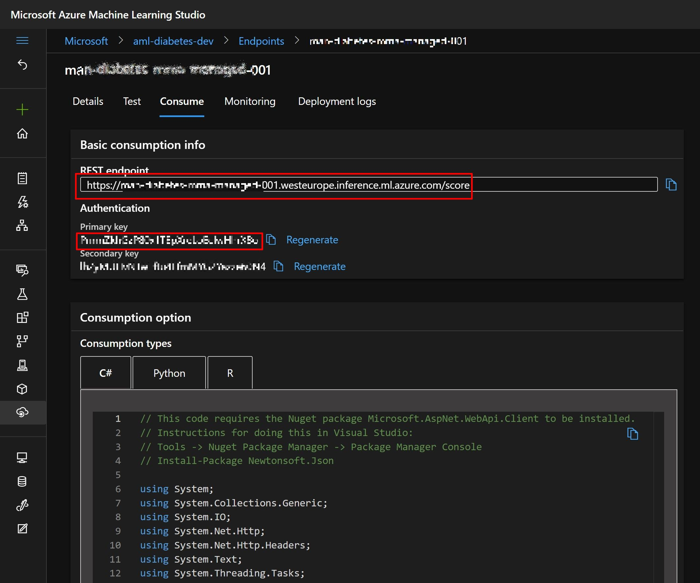
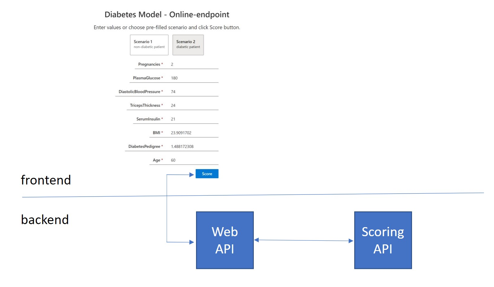

# BLOG - Simple Scoring Web App using Azure Machine Learning Real-Time Endpoints

## aim
This article focuses on practical usage of your deployed ML model using Azure Machine Learning Real-Time endpoints.

The use case is quite simple: assume you have trained your model using Azure Machine Learning (or other tools) and you have deployed this model in Real-Time endpoint using CLI or AzureML studio interface. And now, you would like your users to use that model to predict on their data which are coming from a web app interface (through a basic web form). Simple, isn't it?

And the actual implementation is really an easy one - if you happen to be familiar with things like Web App development, Java Script / React / Angular, CORS, CI/CD, etc... And in case you are not, as I am, here is a simple approach with a help of cool tools.

The selected scenario consists of just couple of steps:
1. Create Web App from template
1. Modify the web app to suit your scoring needs, a.k.a. prepare simple input form for your data
1. Create API to talk to your ML model scoring API
1. Test your code and deploy the App

## technologies used
- Azure Machine Learning - registered / deployed model in Real Time endpoint
- Azure Static Web Apps
- ReactJS/Node.js (MS FluentUI)
- Azure Functions / Python

## Environment setup

```
#TODO
```

## Check the prerequisites

So, assuming you have your model already deployed as an Real-Time endpoint using Azure Machine Learning, basically a web service, a simple API which listen on some URL, e.g. `https://your-endpoint.your-region.inference.ml.azure.com/score`. In order, to test the endpoint you can use pregenerated piece of code or some REST tool like Postman.



For the next steps you need to capture a scoring URL and authentication key to call in your Web App.

## Build your App!

Currently you have a plenty of choices to build a web app - from infrastructure, framework, etc. perspective. I choose [React](TODO), a popular JavaScript framework, but you can choose whatever suits your needs ([Angular](TODO), [XXX](TODO), etc.). The server-side is powered by [Node.js](TODO) with powerfull package manager NPM.

The React is a powerfull JS framework from Facebook and visual part of the frontend I choose [Fluent UI](https://developer.microsoft.com/en-us/fluentui#/get-started) a Microsoft's "open-source React front-end framework designed to build experiences that fit seamlessly into a broad range of Microsoft products".

The best part of chossing the right framework is you don't need to start from scratch - you can use [Create React App](https://facebook.github.io/create-react-app/) template `@fluentui/cra-template`.

So you can easily create your web app project:

```shell
npx create-react-app azureml-scoring-demo-app --template @fluentui/cra-template
```

This will create a project which you can immedietly view in action locally on your computer:

```shell
cd azureml-scoring-demo-app
npm start
```

The `npm start` command will start a developemnt server on localhost which you can access and see immediatly changes you make in the code itself. So it is very convenient to "debug" your front-end.


You have a working Web app which you need to modify and tailor to your ML scoring needs, i.e. insert some form inputs to capture insert your data for scoring.

So, I created just bunch of input fields for my model features and  simple submit button to initiate call to API.

```javascript
<Stack tokens={stackTokens} horizontalAlign="end">
<TextField underlined label="Pregnancies" value={Pregnancies} />
...
<PrimaryButton text="Score" onClick={onScore} allowDisabledFocus />
</Stack>
```

The most important part is `onClick={onScore}` which essentially is a async function which call the scoring endpoint. In JavaScript, you call external API by calling function `fetch` as follows:

```javascript
fetch("/api/score", requestOptions)
    .then(response => response.text())
    .catch(error => console.log('error', error));
```
You cannot call the external API from web browser directly though. If you try you will face most likely CORS errors. TODO CORS.

To solve that, you need to call the external API from the backend, not directly from the frontend. This can be easily done by creating an API ([Azure Functions](TODO), serverless APIs) in your web app which will then call the scoring API. This scenario is depicted on following image.



In [VS Code](TODO) you can conveniently create function based on JavaScript, C#, Python. I chose Python, because in the end why not - you can now combine multiple languages in your project if you like to. To create the function, Ctrl + Shift + P, Static Web apps: Create API (??? TODO).

To implement the API you just need to add call to the external API using `requests` package in Python. Luckily enough, you cat take Postman-generated code and slightly modify to your needs.

```python
payload = json.dumps(...)
headers = {
'Authorization': f'Bearer {endpoint_key}',
'Content-Type': 'application/json'
}

response = requests.request("POST", endpoint_url, headers=headers, data=payload)

return json.dumps(response.json())
```


You can test your API on your local computer. You need just to build your app using:

`npm run build`

Builds the app for production to the `build` folder.<br>
It correctly bundles React in production mode and optimizes the build for the best performance.

Then you can run the APIs and the web app by simply running

`swa start build --api-location api`


I highly recommend to ...
```
#TODO
```

The last thing to do is add some code to control the user input and behavior, like changing the values on change of text fields, handling default vaules, etc.

```javascript
<Stack tokens={stackTokens} horizontalAlign="end">
<TextField underlined label="Pregnancies" value={Pregnancies} onChange={(e: React.FormEvent<HTMLInputElement | HTMLTextAreaElement>, newValue?: string) => setPregnancies(newValue || '')} required={true}/>
...
<PrimaryButton text="Score" onClick={onScore} allowDisabledFocus />
</Stack>
```


## Learn More

You can learn more in the [Create React App documentation](https://facebook.github.io/create-react-app/docs/getting-started).

To learn React, check out the [React documentation](https://reactjs.org/).
